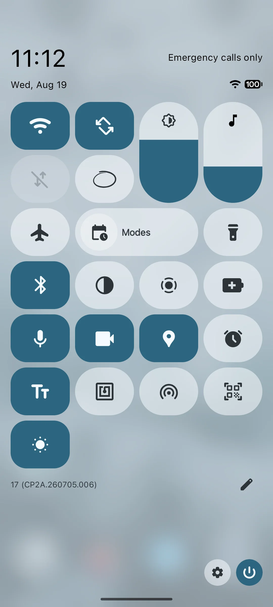
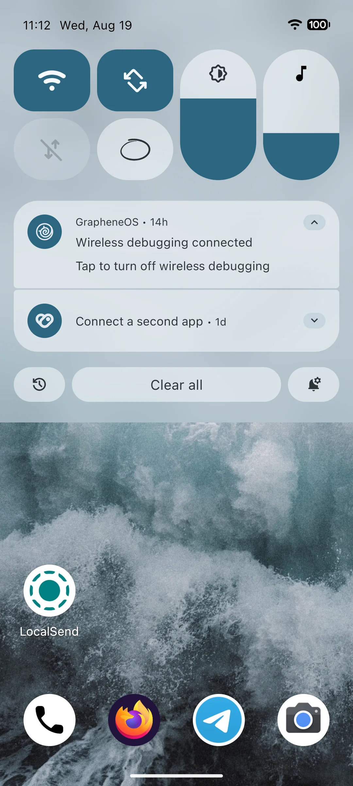

# GrapheneOS Quick Settings vertical sliders

Vertical media volume and brightness sliders for GrapheneOS Quick Settings.

This repository contains changes from commit `e0584607c73d6ebfe81c8b28f9c72eaf35a78537`:

> SystemUI: add vertical brightness and media volume QS grid cells

The sliders are implemented as removable and reorderable vertical 1×2 grid cells in Quick Settings.

## Screenshots

The brightness and media volume controls appear as vertical stadium-shaped sliders in the expanded Quick Settings panel:



They are also visible in the Quick Quick Settings view above the notification shade:



## Download

Download `SystemUI__add_vertical_brightness_and_media_volume_QS_grid_cells.patch` from the [latest release](https://github.com/Andreigr0/systemui-vertical-sliders/releases/latest).

The patch contains only the 68 changed SystemUI files from the commit. Agent-related files such as `.cursor` and `AGENTS.md` are excluded.

## Apply the patch

Use a clean or committed GrapheneOS/AOSP checkout at the matching baseline.

1. Change to the AOSP root, the directory containing `packages/SystemUI`:

```bash
cd /path/to/grapheneos/frameworks/base
```

2. Check that the patch applies without changing anything:

```bash
git apply --check /path/to/SystemUI__add_vertical_brightness_and_media_volume_QS_grid_cells.patch
```

3. Apply it:

```bash
git apply /path/to/SystemUI__add_vertical_brightness_and_media_volume_QS_grid_cells.patch
```

This patch applies the changes to `packages/SystemUI`. `git apply` changes the working tree but does not create a commit. Review the result, then commit it if desired:

```bash
git diff --stat
git add packages/SystemUI
git commit -m "SystemUI: add vertical brightness and media volume QS grid cells"
```

## Compatibility

This change is intended for the corresponding GrapheneOS/AOSP source baseline. Other revisions may require conflict resolution or additional changes outside SystemUI.
